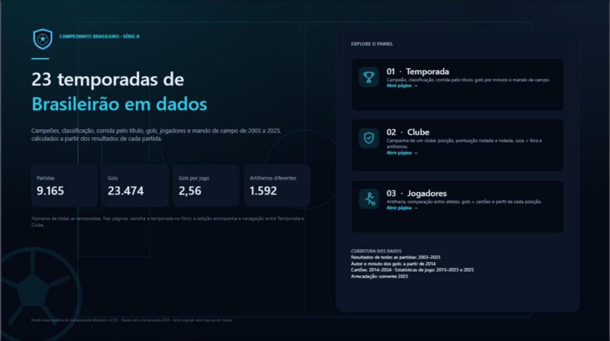
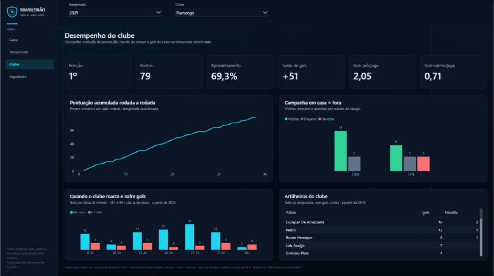
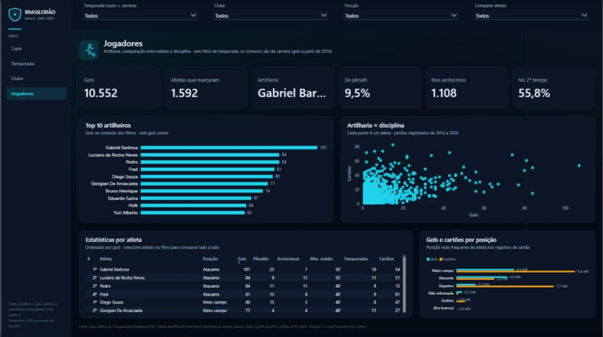
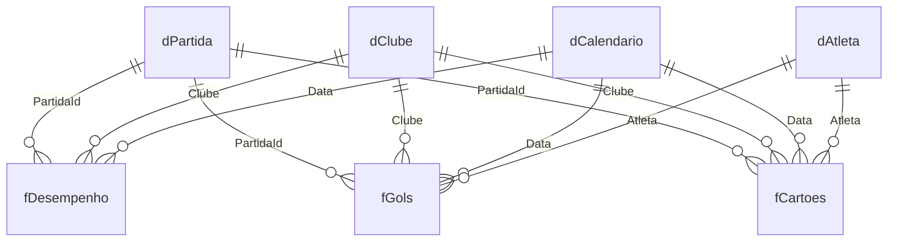

# ⚽ Dash Campeonato Brasileiro · Série A 2003–2025

Um painel em **Power BI** sobre 23 temporadas do Brasileirão: classificação rodada a rodada, campanhas de cada clube, artilharia, disciplina e estilo de jogo. O projeto foi construído de ponta a ponta no formato **PBIP** (PBIR + TMDL), com ETL em Power Query, modelo estrela, 65 medidas DAX, uma página renderizada em **HTML/CSS via DAX** e páginas com visuais nativos.


<table>
  <tr>
    <td width="33%"><br><sub><b>Capa</b> · menu e visão geral</sub></td>
    <td width="33%"><br><sub><b>Clube</b> · campanha de um clube</sub></td>
    <td width="33%"><br><sub><b>Jogadores</b> · artilharia e comparações</sub></td>
  </tr>
</table>

---

## 📊 Fonte dos dados

Os dados vêm do repositório público **[Brasileirao_Dataset](https://github.com/adaoduque/Brasileirao_Dataset)**, mantido por **Adão Duque** no GitHub. Todo o crédito pela coleta e organização é do autor.

| Arquivo | Conteúdo | Registros | Cobertura |
|---|---|---:|---|
| `campeonato-brasileiro-full.csv` | Partidas: data, mandante, visitante, placar, estádio, técnicos, formações, arrecadação | 9.165 | 2003–2025 |
| `campeonato-brasileiro-gols.csv` | Gols: autor, clube, minuto, tipo (pênalti, gol contra) | 10.820 | 2014–2025 |
| `campeonato-brasileiro-cartoes.csv` | Cartões: atleta, clube, posição, minuto, cor | 20.953 | 2014–2024 |
| `campeonato-brasileiro-estatisticas-full.csv` | Estatísticas por clube e partida: chutes, posse, passes, faltas, escanteios | 18.330 | 2015–2025, exceto 2024 |

Os dados também trazem **técnicos** a partir de 2014, **formações** a partir de meados de 2014 e **arrecadação** apenas em 2025.

---

## ❓ Perguntas que o painel responde

O escopo saiu de um levantamento de requisitos feito a partir do próprio modelo de dados, com uma matriz de rastreabilidade que liga cada pergunta ao KPI, à medida DAX e ao visual.

- **Classificação:** quem foi campeão e quem caiu em cada temporada, e como a tabela evoluiu rodada a rodada.
- **Mando de campo:** qual o aproveitamento em casa e fora, e se a vantagem do mandante está diminuindo ao longo dos anos.
- **Gols:** se o campeonato ficou mais ou menos ofensivo, e em que minutos cada clube marca e sofre gols.
- **Jogadores:** quem são os artilheiros, e na temporada, no clube ou na posição; qual a dependência de pênaltis; quem decide nos acréscimos.
- **Disciplina:** quais clubes e posições recebem mais cartões.
- **Estilo de jogo:** se posse de bola se converte em pontos, e quem finaliza e passa melhor.

---

## 🖥️ Páginas

| Página | Tecnologia | Destaques |
|---|---|---|
| **Capa** | Visuais nativos | Menu de navegação com cards e ícones, resumo da cobertura dos dados |
| **Temporada** | **HTML Content via DAX** | Campeão com anel de aproveitamento, gols por jogo com sparkline histórica, artilheiro, rebaixados, classificação completa e gráfico de pontos acumulados, tudo gerado por **uma única medida DAX** que devolve HTML/CSS e SVG |
| **Clube** | Visuais nativos | KPIs da campanha, pontos acumulados rodada a rodada, casa × fora, gols marcados e sofridos por faixa de minuto, artilheiros do clube |
| **Jogadores** | Visuais nativos | Top 10 artilheiros, dispersão gols × cartões, estatísticas por atleta com ranking, gols e cartões por posição; filtros por temporada, clube, posição e atleta |

**Design:**
- tema escuro próprio (`BrasileiraoDark.json`), menu lateral fixo e navegação por botões;
- cores centralizadas em medidas-token, para que o HTML e os visuais nativos usem a mesma paleta;
- imagens (emblema, gramado, ícones) criadas especialmente para o projeto: **nenhum escudo de clube ou marca oficial foi usado**.

---

## 🏗️ Arquitetura

### 1. ETL (Power Query M)

- **Parâmetro `caminhoPasta`:** aponta para a pasta dos CSVs, então basta alterá-lo para rodar em outra máquina.
- **Funções reutilizáveis:**
  - `fxLerCsv` lê os arquivos com a codificação e o delimitador corretos;
  - `fxTemporada` resolve a temporada 2020, que terminou em fevereiro de 2021;
  - `fxFaixaMinuto` agrupa os gols em faixas de 15 minutos, com os acréscimos (45+ e 90+) separados.
- **Consultas de staging** (`stgPartidas`, `stgEstatisticas`) sem carga no modelo, com os tipos definidos explicitamente e as consultas organizadas em grupos.
- **Transformação da partida:** cada jogo vira **duas linhas**, uma para cada clube, com gols pró e contra, resultado, pontos e mando. Isso simplifica todas as medidas de campanha.

### 2. Modelo estrela



| Tabela | Tipo | Granularidade |
|---|---|---|
| `fDesempenho` | Fato | Clube × partida (2 linhas por jogo) |
| `fGols` | Fato | Um gol |
| `fCartoes` | Fato | Um cartão |
| `dPartida` | Dimensão | Partida (temporada, rodada, estádio) |
| `dClube` | Dimensão | Clube (46 clubes) |
| `dAtleta` | Dimensão | Atleta, com a posição mais frequente |
| `dCalendario` | Dimensão | Data (marcada como tabela de datas) |

Todos os relacionamentos são **um-para-muitos com filtro em direção única**. As chaves das fatos ficam ocultas e a navegação é sempre pelas dimensões.

### 3. Medidas DAX (65)

Organizadas em pastas, cada uma com descrição e formatação:

| Pasta | Exemplos |
|---|---|
| 01. Campanha | Pontos, Aproveitamento %, Saldo de Gols, Gols Pró por Jogo |
| 02. Classificação | Posição (desempate Pontos › Vitórias › Saldo › Gols Pró), Pontos Acumulados, Posição na Rodada, Zona, Campeão |
| 03. Liga | Gols por Jogo (Liga), % Vitórias do Mandante, % Empates |
| 04. Gols | % Gols de Pênalti, % dos Gols na Faixa, Gols Sofridos por lance, Artilheiro |
| 05. Disciplina | Cartões Amarelos e Vermelhos, Cartões por Jogo |
| 06. Estilo de Jogo | Posse Média, % Chutes no Alvo, Conversão de Chutes, Precisão de Passe |
| 07. Jogadores | Ranking de Gols, Gols nos Acréscimos, % Gols no 2º Tempo, Minuto Médio do Gol, Gols por Temporada |
| 91. Cores / 92. Páginas HTML | Tokens de cor e a medida que renderiza a página Temporada |

---

## 📐 Regras de negócio adotadas

- **Temporada 2020:** jogos de janeiro a abril de 2021 contam para a temporada 2020 (calendário da pandemia).
- **Pontuação:** 3 pontos por vitória, 1 por empate e 0 por derrota em todas as temporadas.
- **Desempate:** Pontos › Vitórias › Saldo de Gols › Gols Pró. Confronto direto e cartões não entram.
- **Artilharia:** gols contra não contam para o atleta.
- **Classificação:** reflete o resultado de campo, sem as punições do STJD.
- **Rebaixamento:** as 4 últimas posições. Em 2003–2005, com 24 e 22 clubes, só o campeão é destacado.
- **Avisos de cobertura:** o painel informa na tela quando um dado não existe para a temporada escolhida, por exemplo cartões em 2025.

---

## ✅ Validação

As medidas foram testadas com consultas DAX no modelo carregado e comparadas com resultados oficiais conhecidos:

- **2023:** Palmeiras campeão com 70 pontos; rebaixados Santos, Goiás, Coritiba e América-MG.
- **2019:** Flamengo campeão com 90 pontos.
- A classificação por rodada, a artilharia e os percentuais foram conferidos contra os dados brutos.

O relatório PBIR passou na validação estrutural sem erros.

---

## ⚠️ Limitações conhecidas

- **Atletas sem identificador único:** jogadores com o mesmo nome somam juntos.
- **Lacunas nos dados:** gols e cartões detalhados só a partir de 2014; estatísticas de jogo ausentes em 2014 e 2024; cartões ausentes em 2025.
- **Sem árbitro, público ou vagas continentais:** nenhum desses dados está na fonte.

---

## 📁 Estrutura do repositório

```
Dash_CampeonatoBrasileiro/
├── Data/
│   ├── *.csv                                  # dados da fonte
│   ├── Dash_CampeonatoBrasileiro.pbip         # abra este arquivo
│   ├── Dash_CampeonatoBrasileiro.SemanticModel/
│   │   └── definition/                        # TMDL: tabelas, medidas, relacionamentos, M
│   └── Dash_CampeonatoBrasileiro.Report/
│       ├── definition/                        # PBIR: páginas e visuais em JSON
│       └── StaticResources/                   # tema e imagens
└── docs/
    ├── img/                                   # prints das páginas usados neste README
    ├── power-query/                           # auditoria e correções do ETL
    ├── modelagem/                             # revisão do modelo estrela
    ├── levantamento-requisitos/               # requisitos e matriz de rastreabilidade
    ├── dax/                                   # documentação e validação das medidas
    └── paginas/                               # decisões de layout e design
```

## ▶️ Como abrir

1. Instale o **Power BI Desktop** (versão recente, com suporte a PBIP/PBIR).
2. Clone ou baixe este repositório.
3. Abra `Data/Dash_CampeonatoBrasileiro.pbip`.
4. Em **Transformar dados › Parâmetros**, ajuste `caminhoPasta` para a pasta `Data` na sua máquina.
5. Clique em **Atualizar**.
6. Na primeira abertura, aceite a instalação do visual **HTML Content**, que é certificado e vem do AppSource.

---

## 🛠️ Tecnologias

Power BI Desktop · PBIP / PBIR / TMDL · Power Query (M) · DAX · HTML e CSS renderizados por DAX (HTML Content) · SVG · Git

---

**Dados:** [adaoduque/Brasileirao_Dataset](https://github.com/adaoduque/Brasileirao_Dataset), por Adão Duque.
Projeto sem fins comerciais e sem vínculo com a CBF ou com os clubes.
