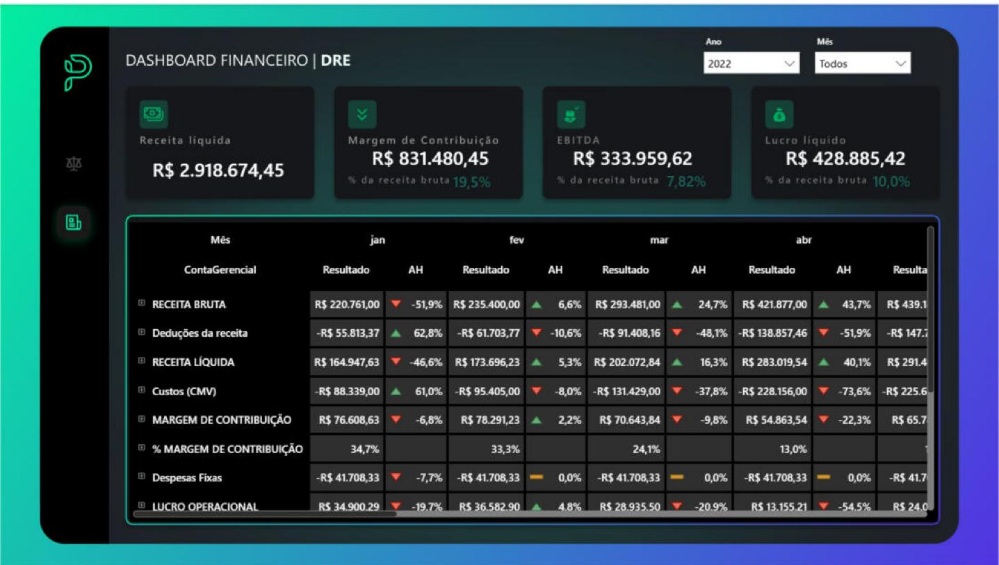
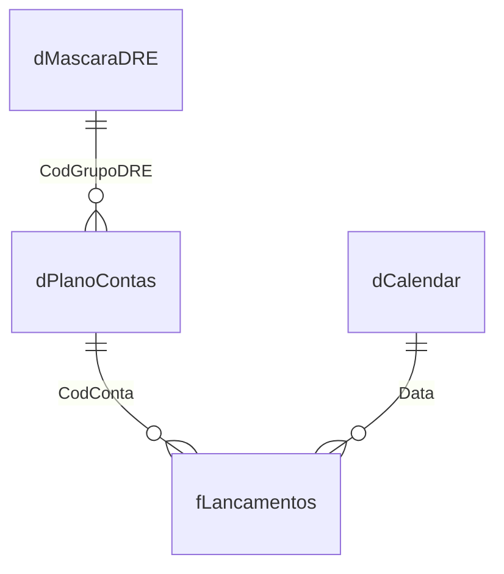

# 📒 Dashboard Financeiro — DRE (Demonstração do Resultado do Exercício)

Painel em **Power BI** que monta uma **DRE gerencial completa** a partir de 273 mil lançamentos contábeis, com subtotais, margens, **análise vertical (AV)** e **análise horizontal (AH)** mês a mês.




---

## ❓ O que o painel responde

- Quanto a empresa **faturou, quanto sobrou de margem e quanto virou lucro** no período?
- Como cada linha da DRE **variou em relação ao mês anterior** (AH)?
- Quanto cada linha **representa da receita** (AV)?
- Qual a **margem de contribuição** e o **lucro líquido** em percentual da receita bruta?

Filtros por **ano** e **mês**. A matriz permite expandir cada grupo da DRE até a conta contábil.

---

## 📊 Dados

| Tabela | Conteúdo | Registros |
|---|---|---:|
| `fLancamentos` | Lançamentos contábeis: data do movimento, conta, tipo e valor | 273.339 |
| `dPlanoContas` | Plano de contas: conta contábil e grupo da DRE a que pertence | 25 |
| `dMascaraDRE` | Estrutura da DRE: ordem, nome da linha e tipo (valor, subtotal ou percentual) | 16 linhas |
| `dCalendar` | Calendário gerado em DAX a partir das datas dos lançamentos | jan/2021–fev/2023 |

Os dados vêm de uma base de lançamentos usada em um desafio de estudo de DRE no Power BI. **Os arquivos de origem não estão neste repositório**; os dados ficam salvos dentro do `.pbix`.

---

## 🏗️ Como foi construído

### Power Query

- **Leitura de pasta:** uma consulta `Folder.Files` lê todas as planilhas de lançamentos de uma vez e as empilha. Novos meses entram só copiando o arquivo para a pasta.
- **Máscara da DRE separada do plano de contas:** a estrutura do relatório (ordem, subtotais e percentuais) fica numa planilha própria. Para mudar a DRE, basta editar essa planilha, sem tocar no DAX.

### Modelo



### A lógica da DRE em DAX

Cada linha da máscara tem um **tipo**, e uma única medida decide o que mostrar:

| Tipo | Significado | Cálculo |
|---|---|---|
| `A` | Linha analítica (ex.: Receita Bruta, Custos) | Soma dos lançamentos da linha |
| `ST` | Subtotal (ex.: Receita Líquida, Lucro Operacional) | Soma acumulada de todas as linhas até ela |
| `PCT` | Percentual (ex.: % Margem de Contribuição) | Subtotal ÷ Receita Bruta |

```dax
VALORES DRE =
VAR tipo   = SELECTEDVALUE ( dMascaraDRE[Tipo] )
VAR codigo = SELECTEDVALUE ( dMascaraDRE[CodGrupoDRE] )
RETURN
    SWITCH (
        TRUE (),
        tipo = "A", [Total],
        tipo = "ST"  && NOT ISINSCOPE ( dPlanoContas[ContaContabil] ), [DRE SUBTOTAL],
        tipo = "PCT" && codigo = 7  && NOT ISINSCOPE ( dPlanoContas[ContaContabil] ), [% Margem Contribuição],
        tipo = "PCT" && codigo = 16 && NOT ISINSCOPE ( dPlanoContas[ContaContabil] ), [% LUCRO LIQUIDO]
    )

DRE SUBTOTAL =
CALCULATE ( [Total], dMascaraDRE[CodGrupoDRE] <= MAX ( dMascaraDRE[CodGrupoDRE] ), ALL ( dMascaraDRE ) )
```

- **`ISINSCOPE`** evita que subtotais e percentuais apareçam ao expandir até a conta contábil, onde não fazem sentido.
- **AH (análise horizontal):** compara o valor do mês com o do mês anterior usando `DATEADD ( dCalendar[Date], -1, MONTH )`.
- **AV (análise vertical):** divide cada linha pela Receita Bruta do mesmo contexto.

### Visual

- Cards de **Receita Líquida, Margem de Contribuição, EBITDA e Lucro Líquido**, com o percentual sobre a receita bruta.
- Matriz com ícones de tendência (▲ ▼) na AH e tema financeiro escuro em verde.

---

## ▶️ Como abrir

1. Instale o **Power BI Desktop**.
2. Abra `Dash_DRE_.pbix`. Os dados já estão salvos no arquivo, então o painel abre sem precisar atualizar.

> A atualização exige a pasta de planilhas original, que não faz parte deste repositório.

---

**Tecnologias:** Power BI Desktop · Power Query (M) · DAX (`SWITCH`, `ISINSCOPE`, `DATEADD`, `CALCULATE`) · modelagem dimensional
