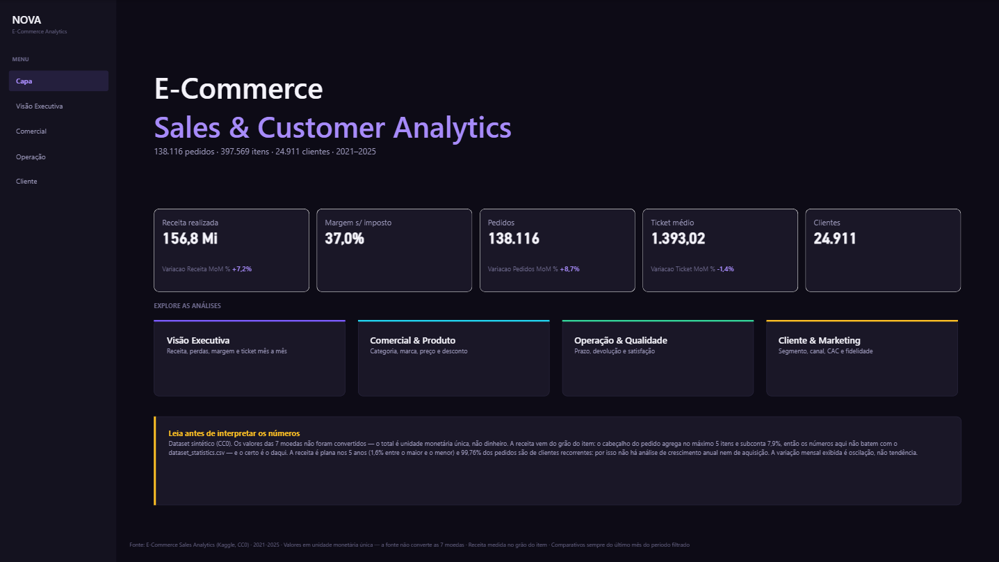
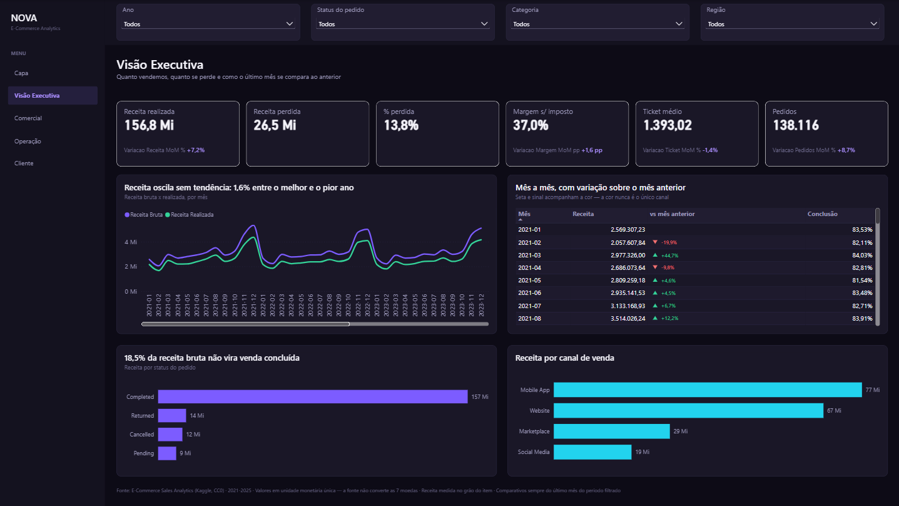
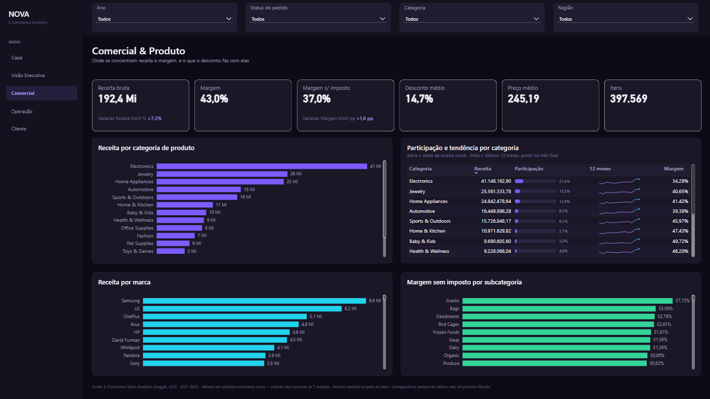
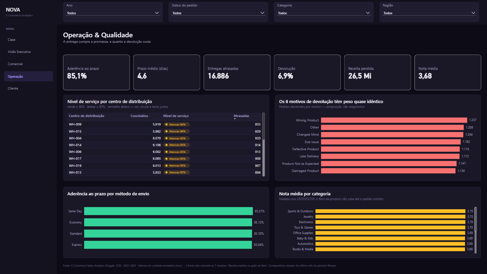
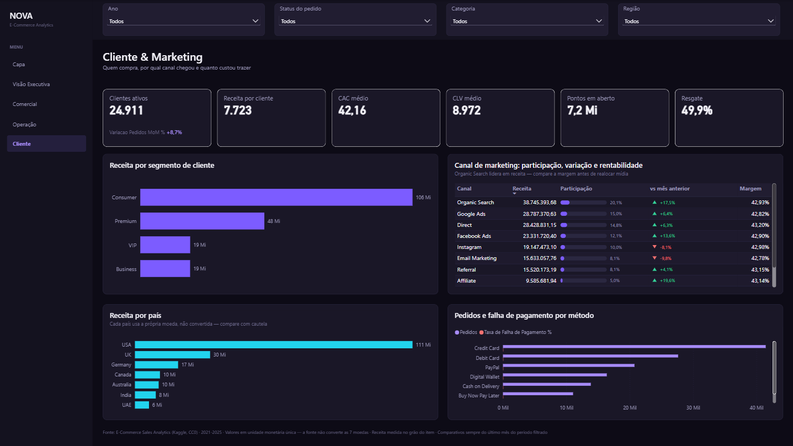

# Dash_Ecommerce_Sales — E-Commerce Sales & Customer Analytics

Dashboard Power BI construído em formato **PBIP/PBIR/TMDL**, do ETL ao relatório, sobre o
dataset público *E-Commerce Sales Analytics* (Kaggle, CC0).

O projeto existe tanto como dashboard quanto como estudo de caso de **auditoria de dados**: a
fonte tem defeitos silenciosos que levariam um relatório descuidado a exibir números errados
com aparência de certos. Eles foram encontrados, medidos e estão documentados aqui.

```
Dash_Ecommerce_Sales/
├── Dash_Sales.pbip                  ponto de entrada
├── Dash_Sales.SemanticModel/        modelo em TMDL (5 tabelas, 91 medidas)
├── Dash_Sales.Report/               relatório em PBIR (5 páginas, 112 visuais)
├── Data/                            5 CSVs de origem (kebab-case)
└── docs/                            requisitos, modelagem, auditoria de ETL e medidas
```

---

## O dashboard

**1920×1080, dark mode, chassi de app shell** com barra lateral de navegação fixa — a
navegação fica no mesmo lugar em todas as páginas, como num aplicativo web.

| Página | Responde |
|---|---|
| **Capa** | Entrada, KPIs principais, atalhos e as ressalvas que condicionam a leitura |
| **Visão Executiva** | Quanto vendemos, quanto se perde em cancelamento e devolução, mês a mês |
| **Comercial & Produto** | Onde se concentram receita e margem; o que o desconto faz com elas |
| **Operação & Qualidade** | Se a entrega cumpre a promessa; quanto a devolução custa |
| **Cliente & Marketing** | Quem compra, por qual canal chegou e quanto custou trazer |

| Capa | Visão Executiva |
|---|---|
|  |  |

| Comercial & Produto | Operação & Qualidade |
|---|---|
|  |  |



Quatro slicers sincronizados entre as páginas (Ano, Status do pedido, Categoria, Região),
cross-filter ativo e rodapé com procedência em todas as telas.

### Tecnologia escolhida, e por quê

**Visuais nativos + tema dark customizado + medidas SVG.** Não HTML.

- **HTML** exigiria o custom visual *HTML Content* do AppSource disponível no ambiente de
  quem abre o arquivo, e páginas HTML não fazem cross-filter nem drill — viram imagem.
- **SVG via `dataCategory: ImageUrl`** renderiza nativamente, sem dependência nenhuma, e
  entrega o acabamento que os visuais nativos não têm.
- **Visuais nativos** sustentam toda a interatividade.

Quatro medidas SVG, em `displayFolder: 90. Visuais SVG`:

| Medida | O que desenha | Onde |
|---|---|---|
| `Participacao Barra SVG` | Barra do share da linha na receita visível, com % | Comercial, Cliente |
| `Receita Tendencia SVG` | Sparkline dos últimos 12 meses, com ponto no mês final | Comercial |
| `Variacao MoM Delta SVG` | Seta + sinal + variação sobre o mês anterior | Executiva, Cliente |
| `Nivel de Servico Pill SVG` | Pill de nível de serviço (verde/âmbar/vermelho) | Operação |

As cores vêm de 12 medidas de token (`91. Cores`), nunca de hex literal dentro do SVG — o
tema e os SVGs mudam no mesmo commit.

### Acessibilidade

Contraste AA sobre o fundo escuro, `altText` em todos os visuais, e **a cor nunca é o único
canal**: o pill traz círculo e texto, o delta traz seta e sinal.

---

## O modelo

Estrela, modo Import, `compatibilityLevel 1606`, cultura `pt-BR`.

```
                   ┌──────────────┐
                   │ dCalendario  │  dia · 1.827 · dataCategory: Time
                   └──────┬───────┘
                          │ OrderDate
┌──────────────┐   ┌──────▼───────┐
│   dCliente   ├──►│   fOrders    │  pedido · 138.116 · métricas NÃO aditivas
│    25.000    │   │              │  + 13 atributos degenerados
└──────────────┘   └──────┬───────┘
                          │ PedidoSK
┌──────────────┐   ┌──────▼───────┐
│   dProduto   ├──►│ fOrderItems  │  item · 397.569 · ÚNICA fonte de receita e lucro
│     1.175    │   └──────────────┘
└──────────────┘
```

Quatro relacionamentos, todos muitos-para-um de direção única. Chaves surrogadas inteiras
(`ClienteSK`, `ProdutoSK`, `PedidoSK`) substituindo as de texto — só em `fOrderItems` isso
eliminou 8.348.949 caracteres de chave. **Integridade validada: zero órfãos, chaves únicas.**

**91 medidas** numa tabela dedicada `Medidas`, em 14 pastas. Nenhuma pendurada em fato ou
dimensão. Cada uma tem descrição `///`, `formatString` e valor esperado conferido contra os
CSVs em `docs/medidas-dax.md`.

### Uma exceção declarada ao estrela puro

`order-items.csv` não traz data nem cliente, então `dCalendario` e `dCliente` filtram os itens
**através de `fOrders`**, em dois saltos. A alternativa seria transformar os 13 atributos do
pedido em dimensão — medi: **102.392 combinações distintas em 138.116 pedidos (74,1%)**. Uma
dimensão com 74% das linhas do fato não é dimensão, é cópia. Os atributos ficam em `fOrders`
como dimensão degenerada.

### O detalhe de DAX que isso impõe

Filtro propaga do lado "um" para o "muitos", nunca o contrário. Logo **`dProduto` não filtra
`fOrders`**: "nota média por categoria" daria o mesmo valor em todas as categorias, em
silêncio. A medida `Nota Media por Produto` resolve com `CROSSFILTER(..., BOTH)` dentro da
própria medida — sem tornar o relacionamento bidirecional e sem abrir caminho ambíguo para as
outras 90.

---

## O que foi encontrado nos dados

Esta é a parte que distingue o projeto. Tudo abaixo foi **medido**, não suposto.

### 🔴 O cabeçalho do pedido agrega no máximo 5 itens

As duas fontes de receita divergiam em **R$ 15.264.613,55**. O diagnóstico:

- 126.890 pedidos (91,9%) batem exatamente entre cabeçalho e soma dos itens
- nos 11.226 divergentes, **100%** têm o cabeçalho igual à soma de um *prefixo* dos itens
- a divergência é 0% em pedido de 1 item e **100% em todo pedido com 6 ou mais**
- `order_status` não explica nada: ~8% uniforme nos quatro status

O cabeçalho ignora o que passa de 5 itens e está **subcontado em 7,9%**. O
`dataset-statistics.csv` bate centavo a centavo com ele — herdou o mesmo erro.

| Fonte | Receita |
|---|---:|
| `SUM(fOrderItems[NetSales])` — **o modelo** | **192.398.877,29** |
| `net_sales` do cabeçalho (coluna removida) | 177.134.263,74 |

**Os números do dashboard não batem com o CSV de estatísticas, e o certo é o do dashboard.**

### 🔴 `QuoteStyle.None` corrompia 8,7% das linhas

O conector gerou `QuoteStyle=QuoteStyle.None` com `Columns=46`. 11.954 linhas têm vírgula
dentro de aspas em `customer_review` e produziam **47 campos**, deslocando todas as colunas
financeiras seguintes — sem erro, porque `returnErrorValuesAsNull` converte o erro em nulo.

### 🔴 Decimais tipados como inteiro, sem cultura

Todo valor monetário estava `Int64.Type` sobre dado decimal, num modelo `pt-BR` lendo CSV com
ponto decimal. `discount_percentage = 0.3396` truncava para **0** — o desconto sumia do
modelo. A correção usa `Currency.Type` **com o terceiro argumento de cultura** (`"en-US"`, a
da fonte), sem o qual a conversão depende da máquina que roda o refresh.

### 🟡 Moedas não convertidas

Sete moedas, uma por país, com preço unitário de mínimo (6,31) e máximo (1.482,95)
**idênticos nas sete**. Os valores não foram convertidos: são a mesma faixa numérica com
rótulo diferente. Por isso o dashboard declara **unidade monetária única** e trata `Currency`
como atributo descritivo.

### 🟡 Três análises que a fonte não sustenta

Não foram construídas, de propósito:

| Análise | Por quê |
|---|---|
| Crescimento anual / YoY | Receita varia 1,6% entre o melhor e o pior ano em 5 anos |
| Aquisição, coorte, retenção | 99,76% dos pedidos são de cliente recorrente (334 novos) |
| Causa-raiz de devolução | Os 8 motivos variam só 8% entre si |

A comparação **mês a mês** existe e está nos cards e na tabela da Visão Executiva — mas é
oscilação, não tendência, e o relatório diz isso.

### Regras confirmadas em 100% das linhas

- `NetSales = GrossSales − DiscountAmount + TaxAmount + ShippingCost`
- `Profit = NetSales − ProductCost − ShippingCost` (397.569 de 397.569, soma das diferenças = 0)
- Como o imposto está dentro da receita, esse lucro conta imposto como lucro: margem 42,98%,
  ou **36,97% sem imposto**. As duas aparecem no dashboard.
- `payment_status` é determinado pelo `order_status`, sem exceção
- `DeliveryDays` e `CustomerRating` são nulos **só** fora de pedido concluído — nulo
  estrutural, não substituído por zero

---

## Pipeline de dados

`Data/*.csv` → camada de staging (4 expressões não carregadas) → 5 tabelas do modelo.

Toda leitura de arquivo e tipagem vive no staging; as tabelas do modelo só projetam. O caminho
dos arquivos vem do parâmetro `caminhoDados`, não de caminho absoluto — **ajuste-o ao clonar
o repositório**.

Duas queries de apoio não carregam no modelo: `statsCargaCsv` (os KPIs pré-calculados do CSV,
fora do modelo de propósito) e `qaValidacaoCarga` (linhas e nulos por coluna crítica).

---

## Como abrir

1. Power BI Desktop recente, com **PBIR** habilitado (Opções → Preview features).
2. Abra `Dash_Sales.pbip`.
3. Ajuste o parâmetro **`caminhoDados`** para a pasta `Data/` deste repositório.
4. Atualize. Carga full, ~563 mil linhas, sem gateway.

Confira `SUM(fOrderItems[NetSales])` = **192.398.877,29**. Se der 177.134.263,74, algo voltou
a ler o cabeçalho do pedido.

---

## Documentação

| Arquivo | Conteúdo |
|---|---|
| `docs/levantamento-requisitos/levantamento-requisitos.md` | Audiência, 10 dores, 18 perguntas de negócio, KPIs com critério de aceite, 15 regras, ressalvas |
| `docs/levantamento-requisitos/matriz-rastreabilidade.md` | 63 itens: dor → pergunta → KPI → medida DAX |
| `docs/levantamento-requisitos/pendencias-cliente.md` | 4 decisões de negócio em aberto, cada uma com padrão definido |
| `docs/modelagem-dimensional.md` | Diagrama, grãos, relacionamentos, dicionário de dados, decisões |
| `docs/power-query/auditoria-2026-10-03.md` | Auditoria de ETL: 14 achados e os dois registros de aplicação |
| `docs/medidas-dax.md` | As 91 medidas com fórmula e valor esperado conferido |

---

## Stack

Power BI Desktop (PBIP/PBIR/TMDL) · Power Query M · DAX · SVG em medida · Git

Modelo e relatório são texto: diff legível, revisão por pull request, histórico real.

---

## Fonte

[E-Commerce Sales and Customer Analytics](https://www.kaggle.com/datasets/datascikhan/e-commerce-sales-and-customer-analytics)
— Shair Khan, licença **CC0: Public Domain**. Dataset sintético, 2021–2025.

Os defeitos descritos acima são da geração do dataset, não da licença nem do autor — e são,
na prática, o que torna o caso interessante.
