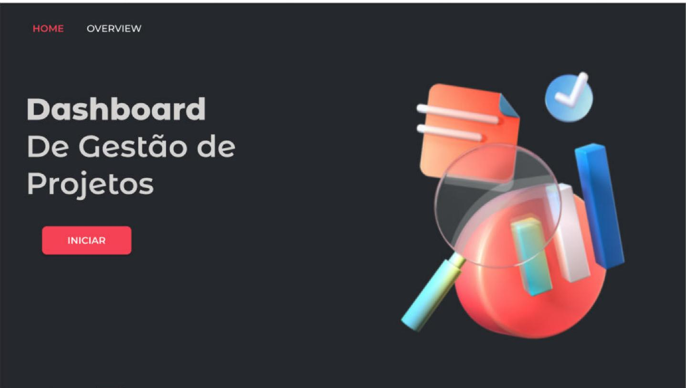
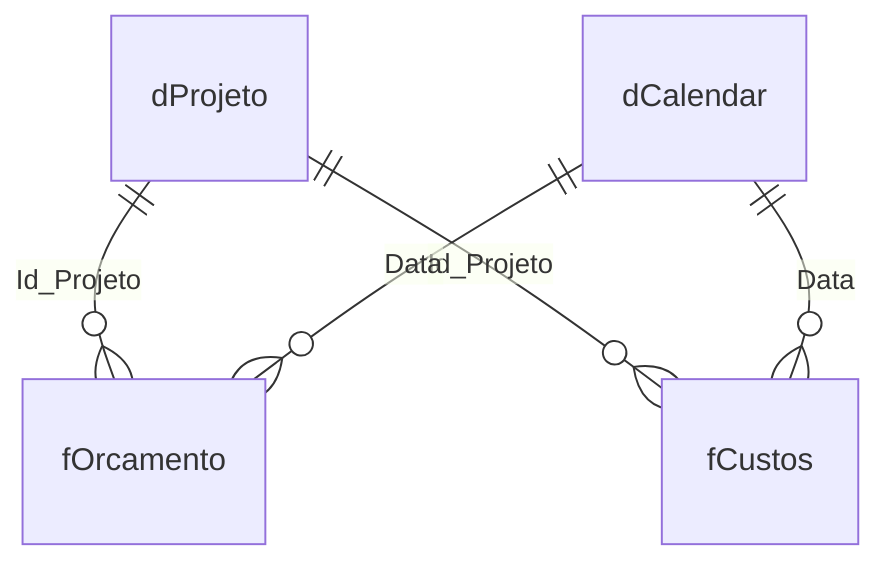

# 📁 Dashboard de Gestão de Projetos — Orçado × Realizado

Painel em **Power BI** para acompanhar o **orçamento de projetos contra o gasto real**: consumo do orçamento, Curva S, comparação com o ano anterior e desempenho por equipe ou por gerente.

<table>
  <tr>
    <td width="50%"> <b>Home</b> · capa e navegação</td>
    <td width="50%"> <b>Overview</b> · orçado × realizado</td>
  </tr>
</table>

---

## ❓ O que o painel responde

- Quanto foi **orçado** e quanto foi **gasto** no ano, e quanto isso representa do orçamento (**% de consumo**)?
- Como o gasto **evolui ao longo do ano** em relação ao planejado (**Curva S**)?
- O gasto está **maior ou menor que no ano anterior**?
- Quanto do gasto é **serviço** e quanto é **material**?
- Quais **equipes** ou **gerentes** consomem mais do orçamento?

---

## 📊 Dados

Base fictícia de projetos, em três arquivos CSV:

| Tabela | Conteúdo | Registros |
|---|---|---:|
| `dProjeto` | Projetos: descrição, equipe, gerente, orçamento, datas de aprovação e conclusão | 10 |
| `fOrcamento` | Valor orçado por projeto e data | 600 |
| `fCustos` | Gastos por projeto e data: item, classificação (serviço ou material) e fornecedor | 600 |
| `dCalendar` | Calendário criado no Power Query | 2020–2024 |

No total, R$ 1,64 bi orçados e R$ 1,21 bi gastos (74% de consumo), com 10 equipes, 10 gerentes e 20 fornecedores. **Os CSVs de origem não estão neste repositório**; os dados ficam salvos dentro do `.pbix`.

---

## 🏗️ Como foi construído

### Modelo (constelação)

Duas tabelas fato, orçamento e custos, compartilham as dimensões de projeto e de calendário. Assim, orçado e realizado podem ser comparados no mesmo visual.

### Power Query

- **Calendário dinâmico:** a `dCalendar` junta as datas de custos, orçamento, aprovação e conclusão, encontra a menor e a maior e gera um dia por linha. O calendário cresce sozinho quando entram dados novos.

### DAX

| Medida | O que calcula |
|---|---|
| `Valor Orçado` / `Valor Gasto` | Somas das duas fatos |
| `Valor Orçado YTD` / `Valor Gasto YTD` | Acumulado no ano (`DATESYTD`), base da **Curva S** |
| `Valor Orçado YOY` / `Valor Gasto YOY` | Mesmo período do ano anterior (`SAMEPERIODLASTYEAR`) |
| `Gasto com Serviços` / `Gasto com Material` | Gasto filtrado pela classificação |
| `% Consumo` | `DIVIDE ( [Valor Gasto], [Valor Orçado] )` |

### Parâmetro de campo

A tabela `Opção de Seleção` é um **parâmetro de campo** do Power BI: os botões **Equipe** e **Gerente Projeto** trocam a dimensão do gráfico de barras sem duplicar visuais.

### Visual

- Capa com navegação por botões (**Home** e **Overview**) e fundos em SVG.
- Cards de orçamento e realizado com o valor do ano anterior, velocímetro de consumo, colunas mensais de orçado × real, Curva S e barras por equipe ou gerente.

---

## ▶️ Como abrir

1. Instale o **Power BI Desktop**.
2. Abra `Dash_Projetos.pbix`. Os dados já estão salvos no arquivo.

> A atualização exige os CSVs originais, que não fazem parte deste repositório.

---

**Tecnologias:** Power BI Desktop · Power Query (M) · DAX (inteligência de tempo) · parâmetros de campo · modelo constelação
