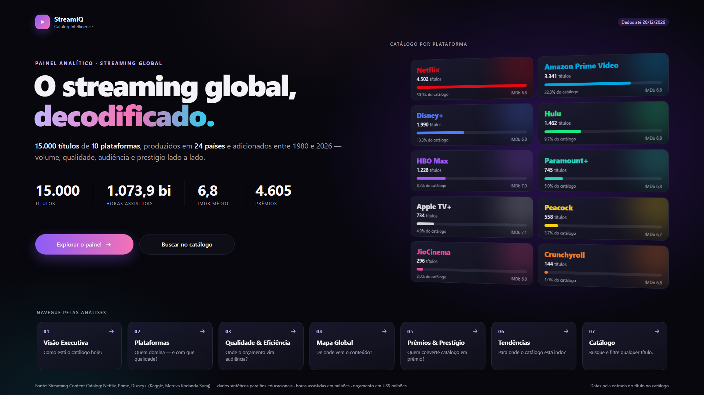
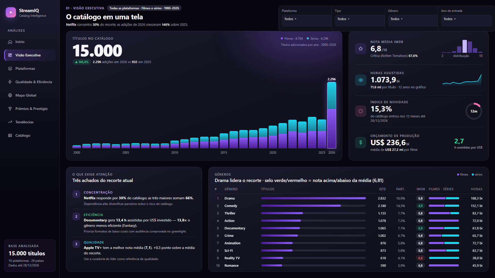
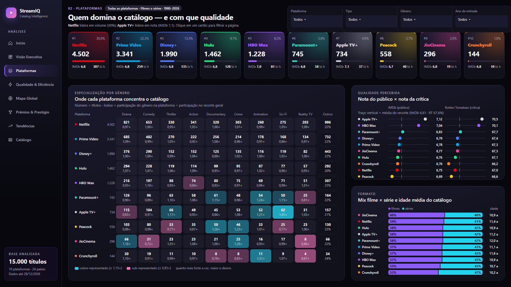
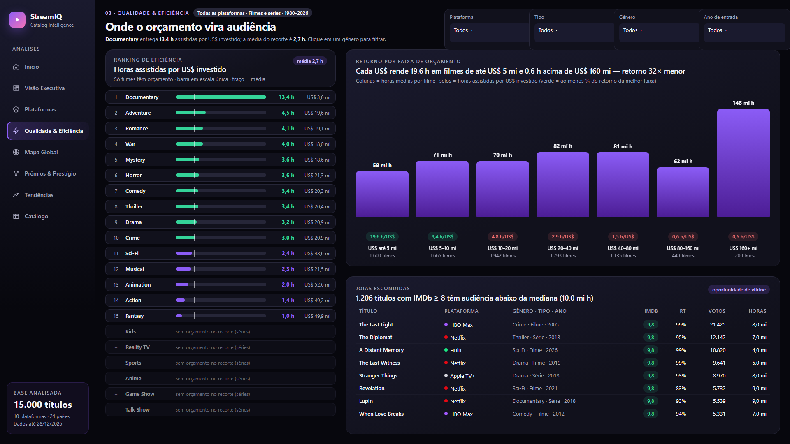
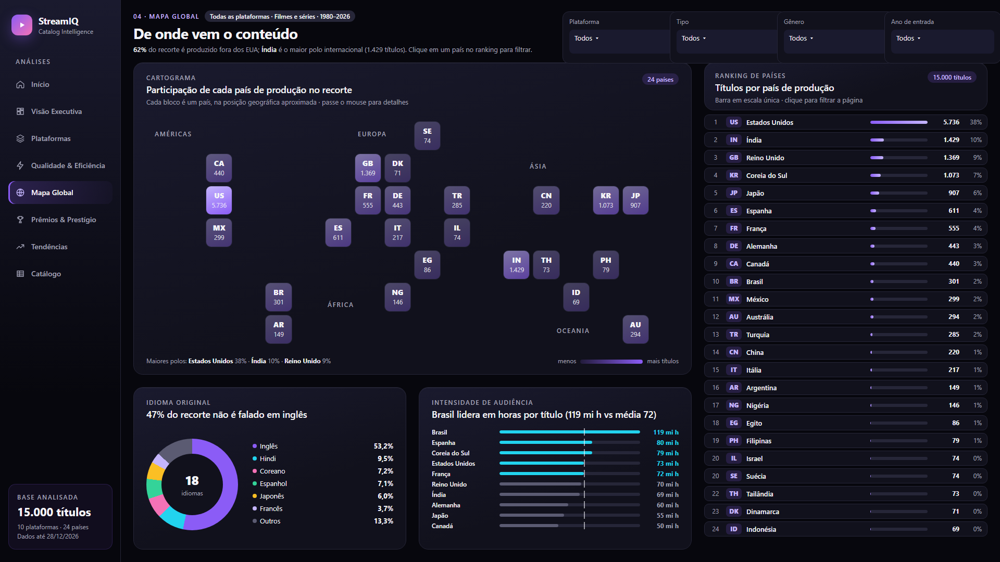
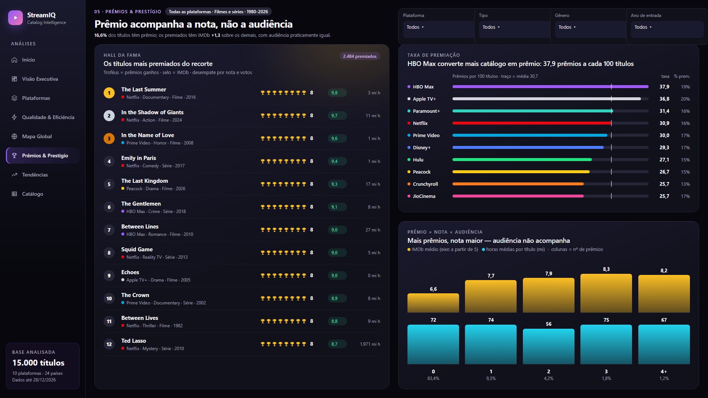
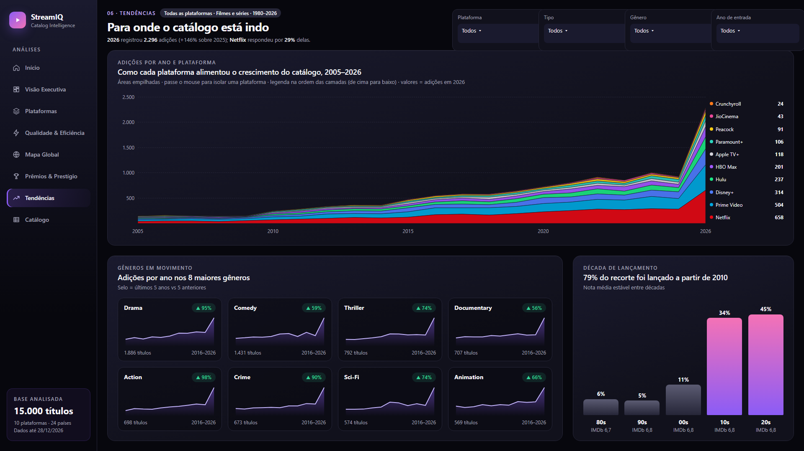
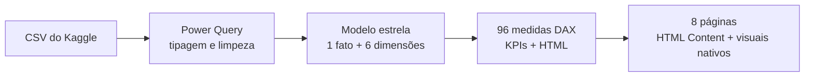
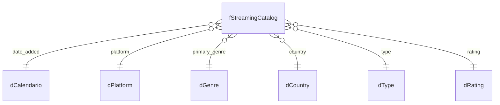

# 🎬 StreamIQ — Catálogo de Streaming em Power BI

Dashboard em Power BI que analisa **15.000 títulos de 10 plataformas de streaming** — volume, qualidade, audiência, eficiência de orçamento e prestígio — em 8 páginas interativas com visual escuro e moderno.



> **Em uma frase:** a Netflix concentra 30% do catálogo, Apple TV+ e HBO Max têm as melhores notas, documentários rendem quase 14× mais horas por dólar do que fantasia, e prêmios acompanham a nota — mas não a audiência.

---

## 📌 Sumário

- [Sobre os dados](#-sobre-os-dados)
- [O que o painel responde](#-o-que-o-painel-responde)
- [Principais achados](#-principais-achados)
- [Como abrir o projeto](#-como-abrir-o-projeto)
- [Como navegar](#-como-navegar)
- [Como foi construído](#-como-foi-construído)
- [Estrutura do repositório](#-estrutura-do-repositório)
- [Limitações](#-limitações)
- [Créditos e licença](#-créditos-e-licença)

---

## 📊 Sobre os dados

**Fonte:** [Streaming Content Catalog: Netflix, Prime, Disney+](https://www.kaggle.com/datasets/meruvakodandasuraj/streaming-content-catalog-netflix-prime-disney?select=yearly_release_trends.csv) — Kaggle, por *Meruva Kodanda Suraj*.

| Arquivo | Linhas | Conteúdo | Usado no modelo? |
|---|---:|---|---|
| `streaming_catalog.csv` | 15.000 | Um título por linha: plataforma, gênero, país, idioma, notas IMDb e Rotten Tomatoes, orçamento, prêmios, horas assistidas | ✅ Fato principal |
| `platform_summary.csv` | 10 | Agregados por plataforma | ➖ Recalculados por medidas DAX |
| `genre_summary.csv` | 21 | Agregados por gênero | ➖ Recalculados por medidas DAX |
| `country_summary.csv` | 24 | Agregados por país | ➖ Recalculados por medidas DAX |
| `yearly_release_trends.csv` | 47 | Tendência por ano de lançamento (1980–2026) | ➖ Recalculados por medidas DAX |

Os quatro arquivos de resumo ficam na pasta `Data/` como referência, mas **não entram no modelo**: todos os números saem da tabela de títulos. Assim não existem duas versões da mesma informação, e os filtros funcionam em todos os indicadores.

> ⚠️ **Os dados são sintéticos.** O próprio autor avisa que nomes de plataformas, atores e produtoras aparecem só para dar realismo; notas, orçamentos e detalhes dos títulos são simulados. **Não use estes números como dados reais de mercado.** O projeto serve como estudo de modelagem, DAX e visualização.

---

## 🧭 O que o painel responde

| # | Página | Pergunta | Prévia |
|---|---|---|---|
| 0 | **Capa** | O que é o painel e por onde começar? | [ver](docs/img/01-capa.png) |
| 1 | **Visão Executiva** | Como está o catálogo hoje? | [ver](docs/img/02-visao-executiva.png) |
| 2 | **Plataformas** | Quem domina — e com que qualidade? | [ver](docs/img/03-plataformas.png) |
| 3 | **Qualidade & Eficiência** | Onde o orçamento vira audiência? | [ver](docs/img/04-qualidade-eficiencia.png) |
| 4 | **Mapa Global** | De onde vem o conteúdo? | [ver](docs/img/05-mapa-global.png) |
| 5 | **Prêmios & Prestígio** | Quem converte catálogo em prêmio? | [ver](docs/img/06-premios-prestigio.png) |
| 6 | **Tendências** | Para onde o catálogo está indo? | [ver](docs/img/07-tendencias.png) |
| 7 | **Catálogo** | Qual é o título X? (tabela pesquisável e exportável) | — |

<details>
<summary><b>🖼️ Ver todas as telas</b></summary>

### Visão Executiva


### Plataformas


### Qualidade & Eficiência


### Mapa Global


### Prêmios & Prestígio


### Tendências


</details>

---

## 💡 Principais achados

*(com todos os filtros limpos; os valores mudam conforme o recorte escolhido no painel)*

| Tema | Achado |
|---|---|
| **Concentração** | A Netflix tem **30%** dos títulos; as três maiores plataformas somam **66%**. |
| **Qualidade** | **Apple TV+ (7,1)** e **HBO Max (7,0)** têm a maior nota média no IMDb; o catálogo inteiro fica em **6,8**. |
| **Eficiência** | Documentários geram **13,4 h assistidas por US$** investido; fantasia gera **1,0 h**. |
| **Retorno do orçamento** | Filmes de até US$ 5 mi rendem **19,6 h por US$**; acima de US$ 160 mi, **0,6 h**. Gastar mais não traz audiência na mesma proporção. |
| **Prêmios** | Títulos premiados têm IMDb **1,3 ponto maior**, mas audiência praticamente igual à dos não premiados. |
| **Audiência** | A mediana é de **10 mi h** por título, contra uma média de **71,6 mi h**: poucos sucessos concentram a maior parte das horas. |
| **Geografia** | **62%** dos títulos são produzidos fora dos EUA; Índia, Reino Unido e Coreia do Sul lideram. O Brasil tem a maior audiência por título (**119 mi h**). |

---

## 🚀 Como abrir o projeto

### Pré-requisitos

- **Power BI Desktop** atualizado (o projeto está no formato **PBIP**, com relatório em PBIR e modelo em TMDL).
- **Internet na primeira abertura:** os painéis usam o visual certificado **HTML Content (lite)**, que o Power BI baixa automaticamente do AppSource.

### Passo a passo

1. **Clone ou baixe** este repositório.
2. Abra o arquivo **`Dash_Streamings.pbip`** no Power BI Desktop.
3. **Aponte para a pasta de dados.** O caminho dos CSVs fica no parâmetro `caminhoDados`, que vem com o caminho da máquina original. Ajuste assim:
   - **Página Inicial → Transformar dados → Editar parâmetros**
   - Em `caminhoDados`, informe a pasta `Data` do seu clone, **terminando com `\`**. Exemplo: `C:\repos\Dash_Streamings\Data\`
4. Clique em **Atualizar**. Pronto.

> 💡 Se algum painel mostrar *"Can't display this visual"*, o visual HTML Content não foi baixado. Confira a conexão com a internet e se a sua organização permite visuais do AppSource.

---

## 🖱️ Como navegar

| Elemento | O que faz |
|---|---|
| **Menu lateral** | Leva para qualquer página. O item da página atual fica destacado. |
| **Filtros no topo** | Plataforma, Tipo, Gênero e Ano de entrada. **Sincronizados**: o filtro acompanha você entre as páginas. |
| **Cartões clicáveis** | Clique numa **plataforma** (página 2), num **gênero** (página 3) ou num **país** (página 4) para filtrar o resto da página. |
| **Passar o mouse** | Colunas, células e blocos mostram detalhes extras. Nas áreas empilhadas (página 6), isola uma plataforma. |
| **Frase abaixo do título** | Cada página resume o principal achado **do recorte atual**; o texto muda com os filtros. |
| **Página Catálogo** | Tabela com todos os títulos: busque pelo nome, ordene pelo cabeçalho e exporte pelo menu do visual. |

---

## 🛠️ Como foi construído

### Etapas



### Modelo de dados (estrela)



- **Fato:** `fStreamingCatalog`, com um título por linha.
- **Dimensões:** plataforma, gênero, país, tipo e classificação etária, geradas a partir do próprio fato, além de uma `dCalendario` (1980–2026) marcada como tabela de datas.
- **Relacionamentos:** todos 1:N, filtrando da dimensão para o fato. Nenhum bidirecional ou muitos-para-muitos.

### Medidas (tabela `Medidas`, organizada em pastas)

| Pasta | Exemplos |
|---|---|
| `01. Volume` | Total de Títulos, Var % Títulos YoY, Índice de Novidade |
| `02. Qualidade` | IMDb Médio, Rotten Tomatoes Médio, Idade Média |
| `03. Engajamento` | Horas Assistidas, Horas Médias por Título |
| `04. Financeiro` | Orçamento Total, Horas por US$ |
| `05. Reconhecimento` | Prêmios Ganhos, % Títulos Premiados, Prêmios por 100 Títulos |
| `06. Formato` | Duração Média de Filme, Temporadas Médias |
| `07. Rankings` | Ranking de Plataforma e de Gênero |
| `91. Cores` | Cores do tema escuro e cor de identidade de cada plataforma |
| `92. Páginas HTML` | Uma medida por painel, que gera o HTML/CSS exibido no relatório |

### Por que HTML + visuais nativos?

- **Painéis em HTML/CSS (visual HTML Content, edição certificada):** permitem layouts que os visuais nativos não fazem, como a capa, o mapa em blocos, a matriz de especialização e o hall da fama. A edição certificada exporta para PDF/PPT e roda **sem JavaScript**: animações, dicas ao passar o mouse e destaques são feitos só com CSS.
- **Visuais nativos:** usados onde a interação importa: filtros sincronizados, busca, tabela exportável e botões de navegação.
- **Cores centralizadas:** todas vêm de medidas da pasta `91. Cores`. Trocar a paleta é mudar um lugar só.

### Correções feitas nos dados

| Problema | Correção |
|---|---|
| O modelo em português lia `6.3` do CSV como **63** (IMDb médio aparecia como 68,1) | Tipagem no Power Query com cultura `en-US` |
| A tabela calendário começava em 2008 e deixava **18%** dos títulos fora das análises por ano | `dCalendario` estendida para 1980–2026 |
| Os resumos do CSV duplicavam números da tabela de títulos | Resumos retirados do modelo; tudo recalculado por medidas |

Mais detalhes em [`docs/`](docs/): auditoria do Power Query, modelo dimensional, levantamento de requisitos e decisões do dashboard.

---

## 📁 Estrutura do repositório

```
Dash_Streamings/
├── Dash_Streamings.pbip              ← abra este arquivo
├── Dash_Streamings.Report/           ← relatório (PBIR: 1 JSON por página e visual)
│   ├── definition/pages/             ← as 8 páginas
│   └── StaticResources/              ← tema escuro StreamIQ-Dark.json
├── Dash_Streamings.SemanticModel/    ← modelo (TMDL: tabelas, medidas, relacionamentos)
│   └── definition/
│       ├── tables/Medidas.tmdl       ← todas as medidas DAX
│       ├── expressions.tmdl          ← parâmetro caminhoDados
│       └── relationships.tmdl
├── Data/                             ← CSVs do Kaggle
└── docs/
    ├── img/                          ← imagens deste README
    ├── power-query/                  ← auditoria do ETL
    ├── modelagem/                    ← modelo dimensional
    ├── levantamento-requisitos/      ← requisitos, KPIs e matriz de rastreabilidade
    └── dashboard/                    ← decisões de design
```

---

## ⚠️ Limitações

- **Dados sintéticos:** algumas distribuições são uniformes demais para gerar conclusões. Por exemplo, cerca de 60% dos títulos são de fora dos EUA em **todas** as plataformas.
- **Datas até 28/12/2026:** a base inclui datas futuras, por isso 2026 aparece como o maior ano de adições.
- **Celular:** o layout foi feito para tela de 1920×1080; o visual HTML Content não tem comportamento garantido no app móvel.
- **Acessibilidade:** leitores de tela não navegam dentro dos painéis HTML. A página **Catálogo** traz os mesmos dados numa tabela nativa.

---

## 🙏 Créditos e licença

- **Dados:** [Streaming Content Catalog: Netflix, Prime, Disney+](https://www.kaggle.com/datasets/meruvakodandasuraj/streaming-content-catalog-netflix-prime-disney?select=yearly_release_trends.csv), por Meruva Kodanda Suraj (Kaggle). A página do dataset cita **CC BY-SA 4.0** no texto e **Apache 2.0** nos metadados; confira a licença antes de redistribuir os CSVs.
- **Marcas:** nomes de plataformas aparecem apenas para identificar os dados. Este projeto não tem relação com Netflix, Amazon, Disney ou qualquer serviço de streaming.
- **Visual de terceiros:** HTML Content (edição certificada / *lite*), de Coacervo Limited, disponível no AppSource.
