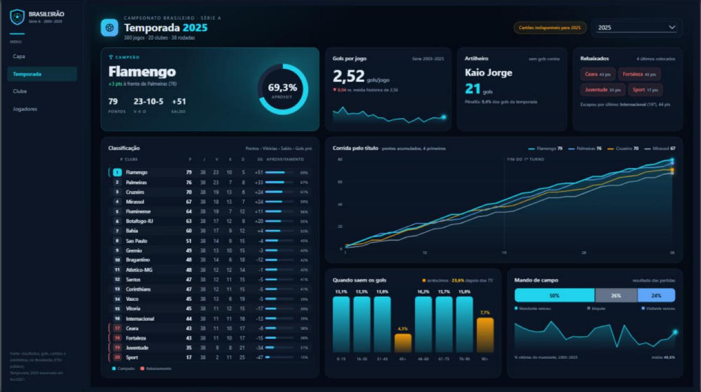
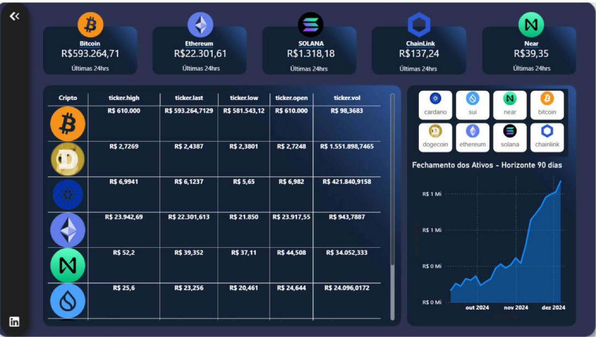
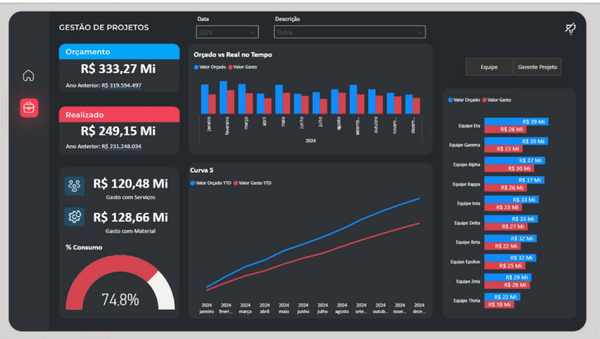

# 📊 Portfólio Power BI — Abraão Barbosa

Coleção de dashboards em **Power BI** que mostra a evolução do meu trabalho com dados: dos primeiros relatórios em `.pbix` a projetos completos em **PBIP** (versionáveis em Git), com Power Query, modelagem dimensional, DAX avançado e páginas em **HTML/CSS renderizadas por DAX**.


---

## 🗂️ Projetos

<table>
  <tr>
    <td width="50%" valign="top">
      <a href="Dash_Streamings/"></a>
      <h3><a href="Dash_Streamings/">🎬 StreamIQ — Catálogo de Streaming</a></h3>
      15 mil títulos de 10 plataformas: volume, qualidade, eficiência de orçamento e prestígio, em 8 páginas.<br>
      <sub><b>PBIP</b> · modelo estrela · 96 medidas · HTML/CSS via DAX · mapa em blocos · filtro cruzado a partir do HTML</sub>
    </td>
    <td width="50%" valign="top">
      <a href="Dash_CampeonatoBrasileiro/"></a>
      <h3><a href="Dash_CampeonatoBrasileiro/">⚽ Campeonato Brasileiro 2003–2025</a></h3>
      23 temporadas da Série A: classificação rodada a rodada, campanhas, artilharia, disciplina e estilo de jogo.<br>
      <sub><b>PBIP</b> · 3 fatos · 65 medidas · funções em Power Query · página em HTML via DAX</sub>
    </td>
  </tr>
  <tr>
    <td width="50%" valign="top">
      <a href="Dash_Cripto/"></a>
      <h3><a href="Dash_Cripto/">₿ Dashboard Cripto</a></h3>
      Cotações de 8 criptomoedas consultadas em <b>APIs públicas</b> (Mercado Bitcoin e CoinGecko): 24h e histórico de 90 dias.<br>
      <sub>Power Query com funções que chamam APIs REST · Chiclet Slicer · imagens por URL</sub>
    </td>
    <td width="50%" valign="top">
      <a href="Dash_Projetos/"></a>
      <h3><a href="Dash_Projetos/">📁 Gestão de Projetos</a></h3>
      Orçado × realizado: consumo do orçamento, Curva S, comparação com o ano anterior e ranking por equipe ou gerente.<br>
      <sub>Modelo constelação · inteligência de tempo (YTD, YOY) · parâmetro de campo</sub>
    </td>
  </tr>
  <tr>
    <td width="50%" valign="top">
      <a href="Dash_DRE/"></a>
      <h3><a href="Dash_DRE/">📒 Dashboard Financeiro — DRE</a></h3>
      DRE gerencial a partir de 273 mil lançamentos contábeis, com subtotais, margens e análises vertical e horizontal.<br>
      <sub>Máscara de DRE dinâmica em DAX (<code>SWITCH</code> + <code>ISINSCOPE</code>) · ingestão de pasta</sub>
    </td>
    <td width="50%" valign="top">
      <h3><a href="BI_Logistica/">🚚 BI Logística Brasil</a> &nbsp;<sub>🚧 em construção</sub></h3>
      Nível de serviço (OTIF), prazos, custo logístico, qualidade e emissões de CO₂ para 1.000 pedidos simulados.<br><br>
      Planejado em 7 etapas: modelo estrela, medidas DAX em camadas, camada <i>JSON Gold</i> e páginas HTML interativas com filtros internos.<br>
      <sub>Base simulada · roteiro de desenvolvimento documentado</sub>
    </td>
  </tr>
</table>

---

## 🧰 O que cada projeto demonstra

| Competência | StreamIQ | Brasileirão | Cripto | Projetos | DRE | Logística |
|---|:---:|:---:|:---:|:---:|:---:|:---:|
| Power Query: limpeza e tipagem | ✅ | ✅ | ✅ | ✅ | ✅ | 🚧 |
| Power Query: funções e parâmetros | ✅ | ✅ | ✅ | | | 🚧 |
| Consumo de APIs REST | | | ✅ | | | |
| Ingestão de pasta de arquivos | | | | | ✅ | |
| Modelo estrela / constelação | ✅ | ✅ | | ✅ | ✅ | 🚧 |
| Tabela calendário | ✅ | ✅ | | ✅ | ✅ | 🚧 |
| DAX: inteligência de tempo | ✅ | ✅ | | ✅ | ✅ | 🚧 |
| DAX: lógica avançada (rankings, `SWITCH`, `ISINSCOPE`) | ✅ | ✅ | ✅ | | ✅ | 🚧 |
| HTML/CSS/SVG renderizado por DAX | ✅ | ✅ | | | | 🚧 |
| Parâmetro de campo | | | | ✅ | | |
| Tema e identidade visual próprios | ✅ | ✅ | ✅ | ✅ | ✅ | |
| PBIP / PBIR / TMDL (versionável) | ✅ | ✅ | | | | 🚧 |
| Documentação (requisitos, modelagem, validação) | ✅ | ✅ | | | | ✅ |

---

## 📈 Evolução

1. **Primeiros projetos (`.pbix`)** — *DRE, Gestão de Projetos e Cripto*: fundamentos de Power Query, modelagem, DAX e design de relatórios, incluindo consumo de APIs.
2. **Projetos em PBIP** — *Campeonato Brasileiro e StreamIQ*: relatório e modelo em arquivos de texto (PBIR + TMDL), versionados em Git, com levantamento de requisitos, auditoria do ETL, modelo estrela documentado, medidas validadas por consultas DAX e páginas em HTML/CSS via DAX.
3. **Em construção** — *BI Logística*: dashboard orientado a um roteiro de desenvolvimento por etapas, com camada de dados *Gold* em JSON alimentando páginas HTML interativas.

---

## ▶️ Como abrir os projetos

1. Instale o **Power BI Desktop** (versão recente, para suportar PBIP/PBIR).
2. Clone o repositório:
   ```bash
   git clone https://github.com/cupim000/PBI_Dashboards.git
   ```
3. Abra o arquivo do projeto:
   - **`.pbix`** (Cripto, DRE, Projetos): abre direto, com os dados salvos no arquivo.
   - **`.pbip`** (StreamIQ, Campeonato Brasileiro): ajuste o parâmetro com o caminho da pasta de dados e clique em **Atualizar**. O passo a passo está no README de cada projeto.
4. Projetos com páginas HTML usam o visual certificado **HTML Content**, que o Power BI baixa do AppSource na primeira abertura (requer internet).

---

## 📁 Estrutura

```
PBI_Dashboards/
├── Dash_Streamings/            ← StreamIQ (PBIP)
├── Dash_CampeonatoBrasileiro/  ← Brasileirão (PBIP)
├── Dash_Cripto/                ← Cripto (PBIX + APIs)
├── Dash_Projetos/              ← Gestão de Projetos (PBIX)
├── Dash_DRE/                   ← DRE (PBIX)
└── BI_Logistica/               ← Logística (em construção)
```

Cada pasta tem seu próprio `README.md` com fonte dos dados, páginas, modelo, medidas e instruções.

---

## 🙏 Créditos dos dados

| Projeto | Fonte |
|---|---|
| StreamIQ | [Streaming Content Catalog: Netflix, Prime, Disney+](https://www.kaggle.com/datasets/meruvakodandasuraj/streaming-content-catalog-netflix-prime-disney) — Kaggle, Meruva Kodanda Suraj (dados sintéticos) |
| Campeonato Brasileiro | [Brasileirao_Dataset](https://github.com/adaoduque/Brasileirao_Dataset) — GitHub, Adão Duque |
| Cripto | APIs públicas do Mercado Bitcoin e da CoinGecko |
| Gestão de Projetos | Base fictícia de projetos |
| DRE | Base de lançamentos contábeis de um desafio de estudo |
| Logística | Base 100% simulada |

Projetos de estudo e portfólio, sem fins comerciais. Marcas e nomes citados pertencem a seus donos.

---

**Contato:** [github.com/cupim000](https://github.com/cupim000)
